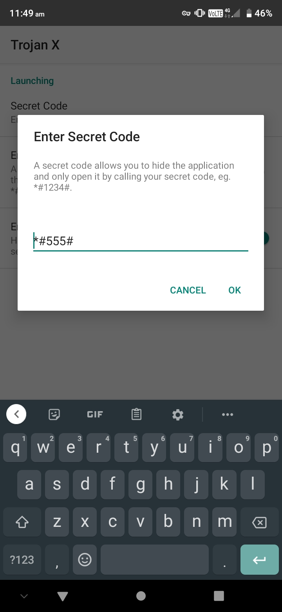

Invisidroid
======
Invisidroid has been inspired by hidden applications on Android, the concept was to break the difficulty in building your own Hidden applications for Android.
Hidden applications are not launched by the App Launcher but by calling a secret number in your dialer.

## Technology
* Java
* XML

## Installation
* You can choose to test the application by downloading the Test.apk file, otherwise building instructions are below.
* Launch the application from your secret code.

## Building Instructions
* Download and Open the project in Android Studio
* Customise the Project and give it a test

## Development Notes
* Activity Aliasing was used over Application Aliasing for security reasons.

### Test the Application in a Pre-built statem
 

